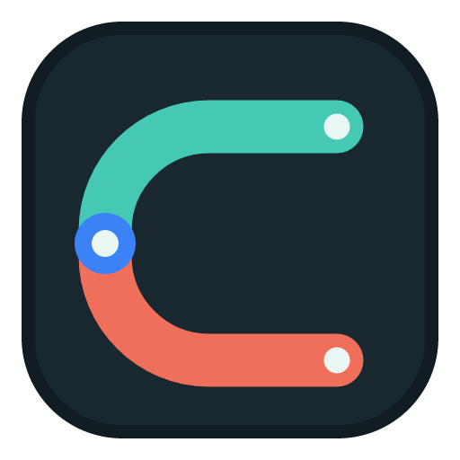

<p align="center">
  <a href="README.md"></a>
  <a href="README.en.md"></a>
</p>

<div align="center">
  

  <h1>DevConduit</h1>

  <p><strong>A local configuration and workflow console for Codex, Claude Code, Grok Build, ZCode, and Kilo Code</strong></p>

  <p>
    <a href="https://github.com/Xdjjw/everything-patch/actions/workflows/main.yml"></a>
    
    
    <a href="LICENSE"></a>
  </p>
</div>

## Overview

DevConduit is a local desktop application for managing instructions, providers, configuration files, Skills, and MCP servers across several AI coding tools. It works with tools and configuration directories already present on your machine, making their current state visible and applying deliberate, traceable configuration changes after confirmation.

It is not a model or account service. After explicit confirmation, the MCP catalog can download pinned upstream files, verify SHA-256, prepare isolated dependencies, and write the target configuration. In Windows local mode it also detects Cheat Engine and x64dbg/x32dbg installations, backs up existing files, and installs the bridge. Manual file selection remains available. DevConduit never rewrites tool configuration merely because the application started.

The project was formerly named Codex-X and Everything Patch. Remaining `codexx`, `codex-x`, `everything-patch`, and legacy data-directory references exist only for backward compatibility; the product name and future releases are **DevConduit**.

## Supported Tools

| Tool | Configuration and instructions | Skills / MCP | Tool-specific capability |
| --- | --- | --- | --- |
| Codex | `config.toml`, authentication, providers, and instructions | Supported | Local session management and Skin Center |
| Claude Code | `CLAUDE.md`, settings, and providers | Supported | Burp MCP SSE connection |
| Grok Build | `AGENTS.md`, TOML configuration, and providers | Supported | Burp MCP stdio proxy configuration |
| ZCode | System role, JSON configuration, and providers | Supported | Burp MCP SSE connection |
| [Kilo Code](https://kilo.ai/) | Global `AGENTS.md` and JSONC configuration | Supported | Native JSONC MCP, global Skills, and `/reload` workflow |

Features are shown according to what is installed locally. Session synchronization, inspection, and deletion are Codex-only. Skin Center is also for Codex only.

## Main Capabilities

### Instructions and Prompts

- Manage bundled and custom Markdown instructions with categories, import, editing, enablement, and disablement.
- Bundle the default Codex, Claude Code, and ZCode templates from their corresponding Keysmith projects for offline use. Kilo also includes an offline default adapted to its global `AGENTS.md`. Enabling any template still requires preview and confirmation; application startup never writes tool configuration automatically.
- Choose whether to preserve existing instructions or replace them, without overwriting content that DevConduit does not manage.
- Create a backup before a managed write so changes can be reviewed or restored. Kilo preserves a fixed snapshot of the original `AGENTS.md` on first install and restores it exactly on uninstall.

### Providers and Configuration

- View, edit, test, and switch providers from one place.
- Manage Codex `config.toml` and `auth.json`, including importing existing providers from cc-switch.
- Read each tool's TOML, JSON, or JSONC configuration, redact sensitive values in previews, and preserve Kilo JSONC comments.

### Codex Session Management

- Search local sessions by project path, title, and ID.
- Inspect session relationships to the active provider and model, then synchronize configuration where appropriate.
- Select individual sessions or entire projects for deletion. Deletion is irreversible and requires confirmation.

### Skills and MCP

- View and import existing Skills and MCP configuration, install ZIP Skills, and enable or disable entries individually.
- Review managed configuration and action results in one place. Failed configuration writes are shown in the dialog and the previous configuration is restored.
- Use the automatic MCP catalog for common reverse-engineering and security tooling, with a manual-file fallback as described below.

### Codex Skin Center

- Import, export, and switch Codex theme packs; live application is supported on macOS and Windows.
- The skin runtime binds only to the local loopback interface and does not modify the official Codex app, `app.asar`, code signature, or configuration-directory permissions.
- Applying a theme may require restarting Codex. Save unsent input and in-progress work first.

## Managed MCP Catalog

From **Skills & MCP**, choose a target tool and integration. The default automatic mode downloads files pinned by revision or release and SHA-256, creates an isolated Python environment where needed, and writes the MCP configuration after confirmation. Managed files live under `mcp-integrations` in the application data directory. Manual mode remains available for offline files and custom versions.

| Integration | Local prerequisites | Windows | macOS |
| --- | --- | --- | --- |
| [IDA Pro MCP](https://github.com/mrexodia/ida-pro-mcp) | IDA Pro 8.3+, Python 3.11+, `uv`, and activated idalib | Managed local runtime | Managed local runtime |
| [Cheat Engine MCP](https://github.com/miscusi-peek/cheatengine-mcp-bridge) | Cheat Engine and Python | Local Named Pipe mode with automatic Lua bridge installation | Remote Windows TCP bridge |
| [x64dbg MCP](https://github.com/Wasdubya/x64dbgMCP) | x64dbg/x32dbg and Python | Automatic matching 32/64-bit plugin installation | Remote Windows HTTP bridge |
| [Burp Suite MCP](https://github.com/PortSwigger/mcp-server) | Burp Suite; Java is also required for stdio proxy mode | SSE or proxy by target tool | SSE or proxy by target tool |

Integration rules:

- Automatic acquisition verifies a pinned SHA-256 before use. A mismatched cache is downloaded again, and a failed verification never writes tool configuration. Sources and licenses are listed in [THIRD_PARTY_NOTICES.md](THIRD_PARTY_NOTICES.md).
- **IDA Pro MCP** runs `uv sync --locked` during initial acquisition, then uses `uv run --offline --no-sync` so runtime startup cannot synchronize dependencies.
- **Cheat Engine and x64dbg** local modes are Windows-only. DevConduit searches common install locations or accepts a portable root, creates a host-file backup, and offers a restore action for the latest install without overwriting plugins changed afterward. On macOS, it connects to a Windows bridge that you operate; a local Mac application cannot write files on that remote host.
- **Burp Suite MCP** supports direct SSE for Claude Code, ZCode, and Kilo Code. Codex and Grok Build use the official `mcp-proxy-all.jar` emitted by the Burp extension as a stdio proxy to avoid transport incompatibilities.
- Two first-time actions remain under the third-party application's control and cannot be reliably performed through an external API: activating IDA idalib and enabling the official extension in Burp's Extensions screen. Everything else, including download, verification, dependency preparation, target configuration, and Windows CE/x64dbg file installation, is automatic after confirmation. A failed write restores both the previous tool configuration and the host files installed by that action.

Connect only to MCP servers and remote bridges that you trust. For HTTP bridges, prefer a trusted network or `127.0.0.1`.

## Downloads and Packages

Use [GitHub Releases](https://github.com/Xdjjw/everything-patch/releases) for published versions. Pushing a version tag such as `v0.4.0` builds and uploads these installers directly to that release:

| Platform | Format | Release installer |
| --- | --- | --- |
| Windows x64 | `.msi` | `DevConduit_<version>_x64.msi` |
| macOS Apple Silicon | `.dmg` | `DevConduit_<version>_aarch64.dmg` |
| macOS Intel | `.dmg` | `DevConduit_<version>_x64.dmg` |

The `Build Package` workflow still produces verification artifacts on pushes to `main`. Apple Developer signing and notarization are not configured for the current release packages, so macOS will ask for confirmation on first open; Windows may also show a SmartScreen prompt.

## Run From Source

Prerequisites: Node.js 22, pnpm 9, and Rust stable. macOS also needs working Xcode Command Line Tools.

```bash
pnpm install --frozen-lockfile
pnpm dev
```

Common validation and packaging commands:

```bash
pnpm typecheck
pnpm build
```

Build for a specific target:

```bash
pnpm --dir apps/desktop build -- --target x86_64-pc-windows-msvc
pnpm --dir apps/desktop build -- --target aarch64-apple-darwin
pnpm --dir apps/desktop build -- --target x86_64-apple-darwin
```

When `TAURI_SIGNING_PRIVATE_KEY` is not set locally, the build wrapper disables updater artifacts that require the release key while still producing regular installers. Release signing and notarization belong to the controlled Release workflow.

## Configuration and Migration

Default Codex paths:

```text
~/.codex/config.toml
~/.codex/auth.json
```

DevConduit continues to use the existing local data directory so an in-place upgrade retains existing configuration:

```text
~/.everything-patch/everything-patch.db
```

Supported environment variables:

```text
CODEX_HOME=/path/to/.codex
EVERYTHING_PATCH_HOME=/path/to/everything-patch-data  # legacy compatibility key
CC_SWITCH_HOME=/path/to/.cc-switch
```

Legacy `CODEXX_HOME`, `~/.codexx/codexx.db`, and `codex-x-skins` locations are detected automatically, so existing users do not need to migrate manually.

## Boundaries

- Review the target tool, configuration directory, file path, and remote endpoint before writing.
- Third-party MCP servers, debuggers, proxies, and theme packs are maintained by their respective authors. Review their licenses, safety guidance, and compatibility requirements before using them.
- Use this project and connected tools only in legal, authorized environments.

## Contributing and License

Please use [Issues](https://github.com/Xdjjw/everything-patch/issues) for bugs, feature requests, and feedback. The project is available under the [MIT License](LICENSE).
