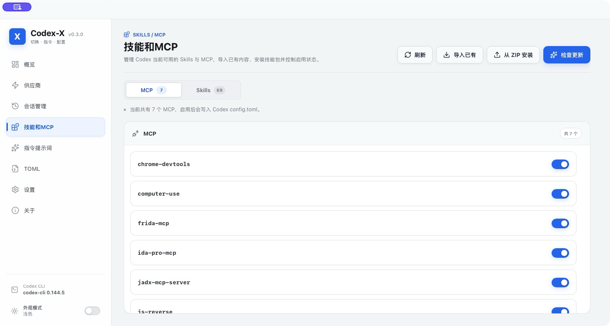

<p align="center">
  <a href="README.md"></a>
  <a href="README.en.md"></a>
</p>

<div align="center">
  

  <h1>Everything Patch</h1>

  <p><strong>Codex、Claude Code、Grok Build 与 ZCode 的本地配置与工作流控制台</strong></p>

  <p>
    <a href="https://github.com/Xdjjw/everything-patch/actions/workflows/main.yml"></a>
    
    
    <a href="LICENSE"></a>
  </p>
</div>

## 概览

Everything Patch 是一个本地桌面工具，用于集中管理多种 AI 编程工具的指令、Provider、配置文件、Skills 与 MCP。它直接对接你已经安装在本机的工具和配置目录，帮助你看清当前状态，并在确认后完成可追溯的配置写入。

它不是模型服务、账号服务或第三方工具安装器。尤其是在 MCP 集成中，Everything Patch 只校验你手动选择的本地文件并写入配置，不会自动下载、安装或执行第三方安装程序。

原项目名为 Codex-X。仓库中仍可见的 `codexx`、`codex-x` 和旧数据目录仅用于兼容已有配置，产品名称与后续发布均以 **Everything Patch** 为准。

## 界面预览

<p align="center">
  
</p>

<p align="center">
  
</p>

## 支持范围

| 工具 | 配置与指令 | Skills / MCP | 专属能力 |
| --- | --- | --- | --- |
| Codex | `config.toml`、登录信息、Provider、指令 | 支持 | 本地会话管理、皮肤中心 |
| Claude Code | `CLAUDE.md`、设置与 Provider | 支持 | Burp MCP 的 SSE 直连 |
| Grok Build | `AGENTS.md`、TOML 配置与 Provider | 支持 | Burp MCP 的 stdio 代理配置 |
| ZCode | system role、JSON 配置与 Provider | 支持 | Burp MCP 的 SSE 直连 |

功能会根据本机实际安装状态显示。会话同步、检查和删除只适用于 Codex；皮肤中心也只面向 Codex。

## 主要功能

### 指令与提示词

- 管理内置与自定义 Markdown 指令，支持分类、导入、编辑、启用和禁用。
- 在“保留原提示词”和“替换原提示词”之间切换，避免覆盖不属于 Everything Patch 管理的内容。
- 写入前创建备份，便于检查和恢复。

### Provider 与配置

- 在一个界面中查看、编辑、测试和切换 Provider。
- 管理 Codex 的 `config.toml` 与 `auth.json`，并支持从 cc-switch 导入已有 Provider。
- 按工具读取对应的 TOML 或 JSON 配置，预览时对敏感信息进行处理。

### Codex 会话管理

- 按项目路径、标题和 ID 搜索本地会话。
- 检查会话与当前 Provider / 模型的关系，并在需要时同步配置。
- 支持精确选择会话或项目范围删除。删除是不可恢复操作，界面会要求再次确认。

### Skills 与 MCP

- 查看和导入已有 Skills / MCP 配置，安装 ZIP Skill，并按条目启用或禁用。
- 在同一处查看受管配置与操作结果，配置写入失败会在弹窗中显示并恢复原配置。
- 提供针对常见逆向与安全工具的手动 MCP 接入目录，详见下一节。

### Codex 皮肤中心

- 导入、导出和切换 Codex 主题包；实机应用支持 macOS 和 Windows。
- 皮肤运行时只绑定本机回环地址，不修改官方 Codex 应用、`app.asar`、代码签名或配置目录权限。
- 首次应用可能需要重启 Codex。请先保存未发送的输入和进行中的工作。

## 手动 MCP 接入目录

在“Skills 与 MCP”页面可以选择目标工具、手动选择项目目录、脚本或 JAR，并在确认后写入 MCP 配置。所有集成均要求你先自行安装和配置第三方软件及其依赖。

| 集成 | 本地条件 | Windows | macOS |
| --- | --- | --- | --- |
| [IDA Pro MCP](https://github.com/mrexodia/ida-pro-mcp) | IDA Pro 8.3+、Python 3.11+、`uv`，且已手动激活 idalib 并完成 `uv sync` | 本地 | 本地 |
| [Cheat Engine MCP](https://github.com/miscusi-peek/cheatengine-mcp-bridge) | Cheat Engine、Python 与 MCP 桥接项目 | Named Pipe 本地模式 | 远程 Windows TCP 桥接 |
| [x64dbg MCP](https://github.com/Wasdubya/x64dbgMCP) | x64dbg/x32dbg 插件、Python 桥接脚本 | 本地模式 | 远程 Windows HTTP 桥接 |
| [Burp Suite MCP](https://github.com/PortSwigger/mcp-server) | Burp MCP Server 扩展；stdio 代理模式还需要 Java | 依目标工具选择 SSE 或代理 | 依目标工具选择 SSE 或代理 |

接入规则：

- **IDA Pro MCP** 使用 `uv run --offline --no-sync`，不会在配置时自动同步或下载依赖。
- **Cheat Engine 与 x64dbg** 的本地模式仅适用于 Windows；在 macOS 上使用时，连接到你自己维护的远程 Windows 桥接端。
- **Burp Suite MCP** 的传统 SSE 直连仅用于 Claude Code 和 ZCode。Codex 与 Grok Build 使用 Burp 扩展提供的官方 `mcp-proxy-all.jar` 作为 stdio 代理，以避免传输协议不兼容。
- 应用会校验所选路径和文件名是否符合对应项目要求。它不会代替你下载项目、安装扩展、创建 Python 环境或执行第三方安装程序。

请只连接自己信任的 MCP 服务和远程桥接地址。对于 HTTP 桥接，建议始终限制在受信任网络或 `127.0.0.1`。

## 下载与安装包

正式版本请从 [GitHub Releases](https://github.com/Xdjjw/everything-patch/releases) 获取。当前的 `Build Package` 工作流会在推送到 `main` 或手动触发时构建以下产物：

| 平台 | 格式 | Actions artifact 名称 |
| --- | --- | --- |
| Windows x64 | `.msi` | `Everything-Patch-package-windows-latest-x86_64-pc-windows-msvc` |
| macOS Apple Silicon | `.dmg` | `Everything-Patch-package-macos-latest-aarch64-apple-darwin` |
| macOS Intel | `.dmg` | `Everything-Patch-package-macos-latest-x86_64-apple-darwin` |

构建验证产物可在 [Actions](https://github.com/Xdjjw/everything-patch/actions/workflows/main.yml) 下载。它们用于测试，不等同于已签名、公证或正式发布的安装包；仅在你信任对应提交内容时使用。

## 从源码运行

前置条件：Node.js 22、pnpm 9 和 Rust stable。macOS 还需要可用的 Xcode Command Line Tools。

```bash
pnpm install --frozen-lockfile
pnpm dev
```

常用校验与打包命令：

```bash
pnpm typecheck
pnpm build
```

按目标平台构建：

```bash
pnpm --dir apps/desktop build -- --target x86_64-pc-windows-msvc
pnpm --dir apps/desktop build -- --target aarch64-apple-darwin
pnpm --dir apps/desktop build -- --target x86_64-apple-darwin
```

本地未设置 `TAURI_SIGNING_PRIVATE_KEY` 时，构建脚本会关闭需要发布私钥的 updater 产物，但仍会生成常规安装包。发布、签名和公证应由受控的 Release 流程处理。

## 配置与迁移

Codex 默认配置路径：

```text
~/.codex/config.toml
~/.codex/auth.json
```

Everything Patch 的本地数据默认位于：

```text
~/.everything-patch/everything-patch.db
```

可用环境变量：

```text
CODEX_HOME=/path/to/.codex
EVERYTHING_PATCH_HOME=/path/to/everything-patch-data
CC_SWITCH_HOME=/path/to/.cc-switch
```

旧版 `CODEXX_HOME`、`~/.codexx/codexx.db` 与 `codex-x-skins` 目录会被自动识别，已有用户无需手动迁移。

## 使用边界

- 在写入前核对目标工具、配置目录、文件路径和远程端点。
- 第三方 MCP、调试器、代理和主题包由其各自作者维护；使用前请阅读其许可证、安全说明和兼容性要求。
- 请仅在合法、合规且获得授权的环境中使用本项目及其连接的工具。

## 贡献与许可证

欢迎通过 [Issues](https://github.com/Xdjjw/everything-patch/issues) 报告问题、提出功能建议或提交改进。项目使用 [MIT License](LICENSE)。
